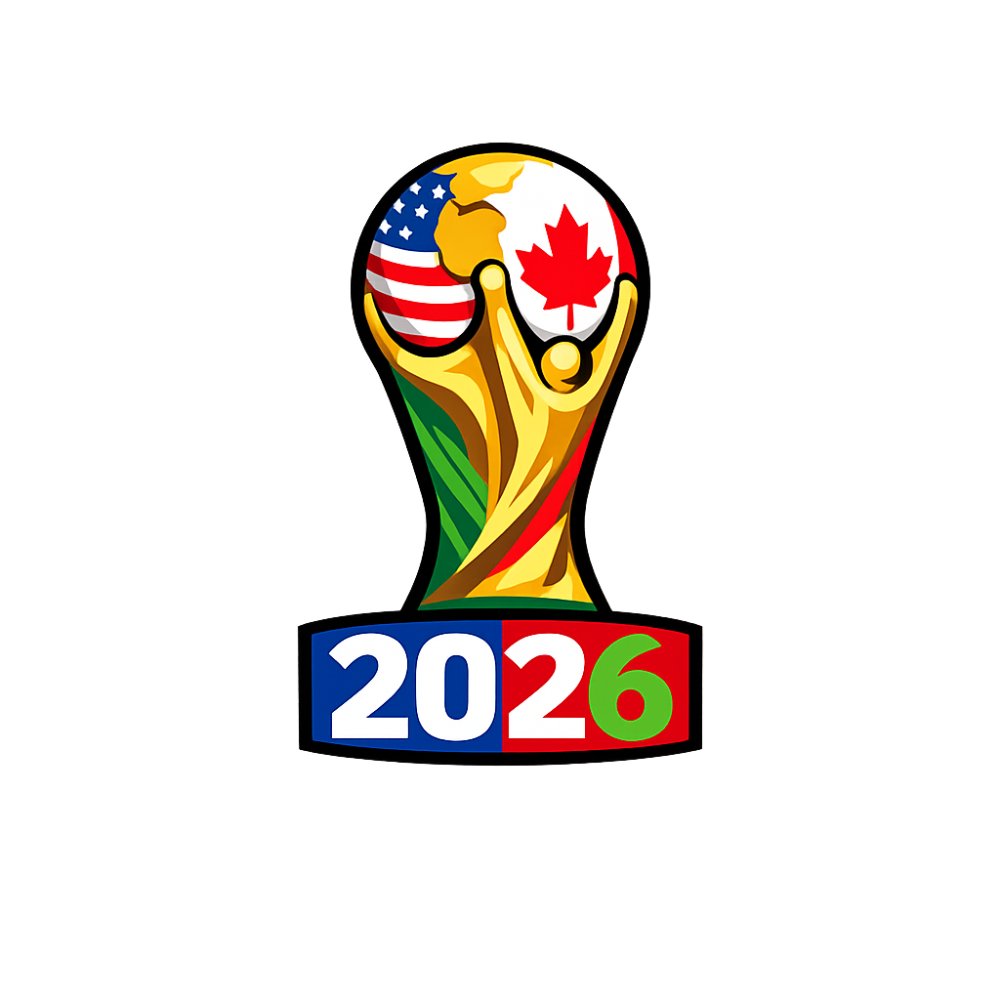
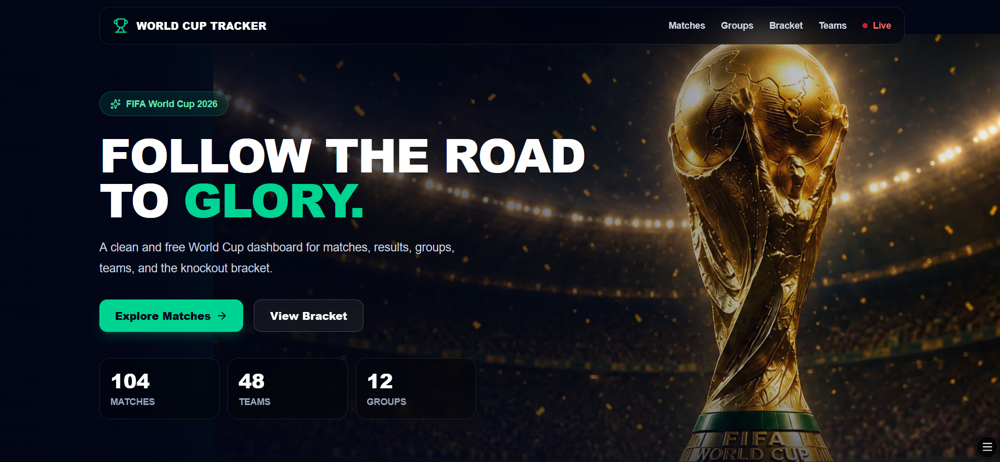

# World Cup Tracker 2026


A modern and free FIFA World Cup 2026 tracker built with **Next.js**, **Prisma**, **Neon PostgreSQL**, and the **Football Data API**.
<p align="center">

</p>
The app displays matches, live games, teams, group standings, and the knockout bracket using synced data stored in a PostgreSQL database.


## Live Demo

[View the app](https://world-cup-tracker-hazel.vercel.app/)

## Latest Update

- Added search modals for Matches, Groups, and Teams.
- Introduced bracket round filtering for easier navigation.
- Improved match cards with localized date/time display.
- Automated data synchronization every 5 minutes using GitHub Actions and Vercel.

## Features

- ⚽ World Cup match schedule
- 🔴 Live matches page
- 📊 Group standings
- 🏆 Knockout bracket
- 🌐 Team pages
- 🔁 Automatic data sync with GitHub Actions
- 🗄️ Neon PostgreSQL database
- ⚡ Deployed on Vercel
- 🎨 Responsive dark sports-themed UI
- 🔍 Search modals for Matches, Groups, and Teams for quick navigation.
- 🏆 Interactive knockout bracket with round filtering (All Rounds, Round of 16, Quarter-finals, Semi-finals, Final, etc.).

## Tech Stack

- Next.js 16
- React 19
- TypeScript
- Tailwind CSS
- Prisma 7
- Neon PostgreSQL
- Football Data API
- GitHub Actions
- Vercel

## Project Structure

```txt
app/
├── api/
│   └── sync/world-cup
├── matches/
├── groups/
├── bracket/
├── teams/
├── live/
├── icon.png
└── page.tsx

src/
├── lib/
│   ├── prisma.ts
│   └── football-data.ts
├── services/
│   ├── matches.ts
│   ├── teams.ts
│   ├── standings.ts
│   ├── bracket.ts
│   └── live.ts
```

## Data Sync

The app does not call the football API directly from the frontend.

Instead, data flows like this:

```txt
Football Data API
        ↓
Sync API Route
        ↓
Neon PostgreSQL
        ↓
Prisma Services
        ↓
Next.js UI
```

A GitHub Actions workflow triggers the sync endpoint automatically.

## Getting Started

Install dependencies:

```bash
npm install
```

Generate Prisma client:

```bash
npx prisma generate
```

Run the dev server:

```bash
npm run dev
```

Open:

```txt
http://localhost:3000
```

## Environment Variables

Create a `.env` file:

```env
DATABASE_URL=
FOOTBALL_DATA_API_TOKEN=
SYNC_SECRET=
```

## Status

This project was created as a portfolio/practice project to explore:

- API integration
- Database syncing
- Prisma ORM
- Scheduled jobs
- Sports dashboard UI
- Vercel deployment

## Preview



## Author

Built by [Massi](https://github.com/Massiziane)
